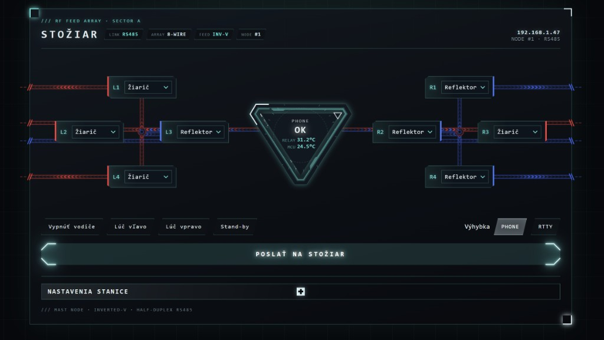

# Stožiar — ovládanie inverted-V poľa

Webové ovládanie osemvodičovej inverted-V antény. Master (ESP32-C3) v boxe na stole hovorí po RS485 s Arduino Nano na stožiari. Nano spína relé; firmware na Nano sa nemení.



## Čo to robí

Osem vodičov (L1–L4 vľavo, R1–R4 vpravo) ide nastaviť na:

| Stav | Význam | Farba v HUD |
|------|--------|-------------|
| **Žiarič (A)** | radiátor | červená |
| **Reflektor (B)** | reflektor | modrá |
| **Vypnutý (C)** | off | bledý |

Profily **Lúč vľavo** / **Lúč vpravo** nastavia celú stranu naraz. **Vypnúť vodiče** dá všetko na C. Tlačidlo **Poslať na stožiar** odošle konfiguráciu na Nano.

**Výhybka PHONE / RTTY** je lokálne relé na ESP32 (GPIO), nie na stožiari.

## Hardvér

```
[prehliadač] --Wi-Fi--> [ESP32-C3 master] --RS485 9600 half-duplex--> [Arduino Nano] --relé--> 8 vodičov
                                              OLED, PCA9685 LED
                                              výhybka PHONE/RTTY
```

- **Master:** ESP32-C3, web na porte 80, I2C OLED, voliteľne PCA9685 na LED, RS485 na pinoch 20/21
- **Klient:** Arduino Nano, node ID `#1`, 16 relé (A/B na vodič), NTC teploty T1 (MCU) a T2 (relé)

## Súbory

| Súbor | Úloha |
|-------|--------|
| `ovladanie-antena-ext-box.ino` | Master — Wi-Fi, web, RS485, LED, OLED, USB |
| `html_pages.h` | HUD (HTML/CSS/JS), posielané po častiach |
| `config.h` | Piny, timeout, `extern` stavy |
| `ovladanie-antena-klient-nano.ino` | Firmware stožiara — **nemení sa** |
| `preview-web-ui.html` | Náhľad HUD v prehliadači bez ESP32 |

## HUD — stavy v strede

Farba trojuholníka a veľký nápis:

| Nápis | Význam |
|-------|--------|
| **OK** | stožiar potvrdil, teploty MCU / RELAY |
| **ČAKÁ SA** | príkaz je na ceste, čaká sa ACK |
| **TIMEOUT** | ACK neprišiel (~800 ms); relé na stožiari ostávajú ako naposledy |
| **SPÁNOK** | stand-by: ticho na RS485 a LED, relé sa nemenia |
| **ERR SEN T1 / T2 / ALL** | spojenie OK, NTC hlási chybu (`999.0`) |

Vodič s nápisom **SYNC** čaká na potvrdenie zo stožiara.

Schéma kreslí tok signálu v trubkách: vlna ide z hubu **do** bloku vodiča a až potom **von** k okraju.

## RS485 kontrakt (Nano)

Príkaz (presne 8 znakov A/B/C, node 1):

```
#1 AACBBBCC
```

ACK:

```
#1ACK:AACBBBCC,T1:24.5,T2:31.2
```

Chyba čidla = teplota `999.0`. Master neposiela druhý paket, kým čaká na ACK. Heartbeat je cca 30 s (pri TIMEOUT častejšie).

## Web

Po pripojení na Wi-Fi otvor IP z OLED alebo z pravého horného rohu HUD (napr. `http://192.168.1.47/`). PIN je v **Nastavenia stanice**.

Užitočné cesty:

- `/` — HUD
- `/set` — odoslanie vodičov (neblokuje)
- `/api/status` — JSON stavu a teplôt (poll každých 5 s)
- `/profile` — profily lúča (POST)
- `/toggleStandby` — stand-by

Náhľad bez hardvéru: otvor `preview-web-ui.html`.

## Nahratie firmware

1. Master: Arduino IDE / board ESP32-C3, sketch `ovladanie-antena-ext-box.ino` (pribalí `config.h` a `html_pages.h`).
2. Klient: Nano, sketch `ovladanie-antena-klient-nano.ino` — len ak ide nový kus; bežiaci stožiar sa neprepisuje.
3. SSID, heslo a PIN sa nastavia vo webe (Nastavenia stanice) a ostanú v NVS. V zdroji nie sú.

USB konzola na masteri berie príkazy ako `SETVAL` / `SETMODE` (rovnaká anténa, bez webu).
